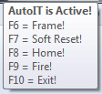
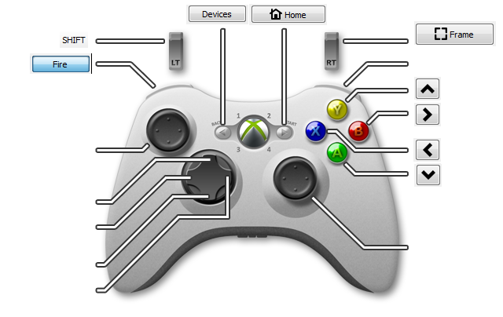

# lightburn-autoit
## Version
v0.3

## Description

This is a automation script that is writtin in AutoIT and binds action to F6 - F10. When loaded a Tooltip will appear with the keys and hotkey.

  

|Function  | HotKey | Action |
|----------|--------|--------|
|Frame     | F6     | This wil click on the `Frame`  button, then it will center focus on the workfield so numpad wil work. |
|Soft Reset| F7     | This will Rightclick on the `Devices` button, then it will center focus on the workfield so numpad wil work. |
|Home      | F8     | This will click on the `Home` button         |
|Fire      | F9     | This will click on the `Move` Tab, then it will click on the `Fire` button, then it will center focus on the workfield so numpad wil work.        |
|Exit      | F10    | This will quit the AutoIT tool             |

## Download
Compiled file: [here](https://github.com/CoolZeroNL/lightburn-autoit/raw/master/Hotkeys-v0.3.exe)

Source: [here](https://github.com/CoolZeroNL/lightburn-autoit/tree/master/config/autoIT_src)

# XBOX360 Controller
## AntiMicro

U can use this then with a xbox360 controller, trough antimicro. Map the Controller Key to the new HotKeys.
I have mapped the following:

- Back = F7  
- Start = F8
- Left Bumper = F9  
- Left Trigger = SHIFT  
- Right Trigger = F6
- Y = Numpad Up (2)
- X = Numpad Right (6)
- B = Numpad Left (4)
- A = Numpad Down (8)

this config file is availible: [here](https://raw.githubusercontent.com/CoolZeroNL/lightburn-autoit/master/config/antimicro/antimicro-config.amgp?token=AGICJABAMS3A3RPSRX7X4XK63EDE2)

  

# Usage

Start LightBurn, if u want to use the Fire button the be sure that it is enabled before starting this tool (hotkeys.exe or though the autoit source code).
When Lightburn is started, you can start this tool. When you see the tooltip, the tool is active and you can use the HotKeys.

ps. The first time u start the tool, and use a HotKey there can be a delay, after the first time it will response immidedly

# Tools
## AnitMicro
Want to map XBOX360 to HotKey, then you can use AntiMicro..

[here](https://github.com/CoolZeroNL/lightburn-autoit/raw/master/tools/antimicro-2.23-win32.msi.7z)

## AutoIt
Want to edit or change the source code, then u need AutoIt..

[here](https://github.com/CoolZeroNL/lightburn-autoit/raw/master/tools/autoit-v3-setup.exe)

# To do:
- [] do action only when lightburn is started and active.
- [] testing